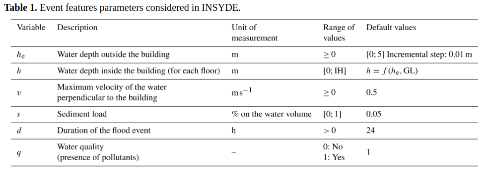
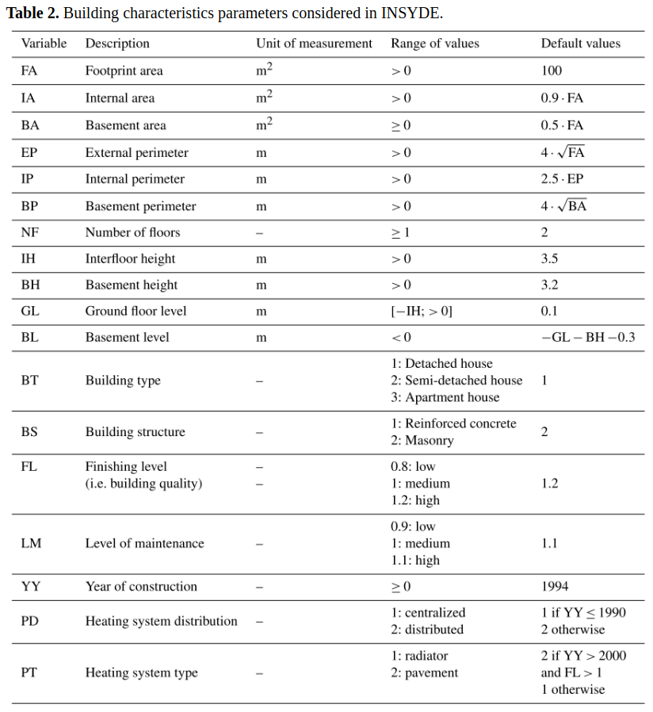

# Introduction
Flood damage evaluation is a crucial component of any strategy for flood risk mitigation and management. 
In particular, models and methodologies for estimating economic damages are key for evaluating and comparing flood mitigation measures and for defining flood risk management plans. 
Synthetic models adopt a conceptual expert-based approach using hypotheses and assumptions about damage mechanisms (what-if analysis). 
Synthetic damage models can be employed for a variety of applications, such as the derivation of damage functions for different types of assets, post-event damage estimation, and analysis of uncertainty sources in damage assessments. 
Still, subjectivity in what-if analyses may result in uncertain damage estimates. 
In addition, these models are often affected by a lack of transparency, which limits their applicability, transferability, and improvements.
Indeed, in many cases the rationale behind model development (e.g. assumptions, mechanisms considered, built-in parameters) is not clearly presented and relevant variables to be used are not well explained.
In this paper we propose a probabilistic methodology to derive synthetic damage curves for residential buildings called INSYDE (In-depth Synthetic Model for Flood Damage Estimation). 
The method is based on an explicit component-by-component analysis of physical damages to buildings, which takes into account available knowledge on damage mechanisms. 
INSYDE is transparent and applicable to different contexts. 
Implemented functions and values are clearly explained so that they can be totally or partly modified according to the physical context in which the model is applied. 
Conversely, the methodology allows for different levels of detail in the analysis, hence the damage model can be adapted to the actual knowledge of relevant hazard and vulnerability variables.
The damage functions composing the model have been designed using an expert-based approach with the support of existing scientific and technical literature, loss adjustment studies, and damage surveys carried out for past flood events in Italy. 
Note: The version in this paper is limited to residential building damage estimation. 
It is important to note that the current version presented in this paper is limited to residential building damage estimation. 
The general methodology, however, can be extended to other types of assets, such as commercial or industrial buildings.

# Model description
INSYDE adopts a synthetic approach consisting of the simulated, step-by-step inundation of residential buildings, and in the evaluation of the corresponding damage based on building and hazard features. 
Such a methodology can also be referred to as a what-if analysis. 
Damages are first modelled on a component-by-component basis using physically based mathematical functions and are then converted into monetary terms using full replacement costs derived from reference price lists. 
The overall economic damage to a building is obtained by summing each of the different damage components: clean-up and removal costs, structural damage, non-structural damage, damage to finishing elements, damage to windows and doors, and damage to building systems. 
For each subcomponent, a mathematical function describing the damage mechanism and associated cost is formulated, considering expert-based knowledge as well as available technical and scientific documentation.
The general formulation can be described as follows: 
event features include all the physical variables describing the flood event at the building location, e.g. maximum external and internal water depth, flood duration, water quality (presence of contaminants) and sediment load. 
Building characteristics include all the variables that describe features and geometry of the building. 
Building features affect damage estimation either by modifying the functions describing damage mechanisms (e.g. system distribution, build- ing structure) or by affecting the unit prices of the building components by a certain factor (e.g. building type, finishing level). 
Conversely, the geometrical properties of the building (e.g. footprint area, number of floors) are used in the estimation of the extension of damage to each of the building components. 
Unit prices refer to the cost of replacement or reparation of the building components per unit of measure (e.g. door removal cost per square metre, pavement replacement cost per square metre).
The cost for each subcomponent is determined by the unit price (up) and the extension (ext). 
The latter is the measure of the physical dimension of the damage (e.g. m 2 of plaster damaged) and depends on the event features and building characteristics. 
This distinction is useful for model generalization. 
The extension of the damage is determined only by the physical effects that the flood event causes to the building; 
therefore, the same approach can be applied in different countries or geographic areas, provided that the local characteristics of the buildings are accounted for. 
Unit prices, instead, vary from country to country or even within a country, they can also be referred to standard or default unit prices in official publications. 
Therefore, local price values are well identified and can be easily replaced with more suitable ones in this approach. 
Tables 1 and 2 describe in detail the event features and building characteristics parameters, their unit of measurement, their range, and the default values in case no information is supplied to the model. 
The variables listed in Tables 1 and 2 can directly affect damage estimation in terms of extension or indirectly by influencing other variables.
An example of the latter case is YY (year of construction), which has no direct impact on the damage mechanisms of the different building subcomponents but indirectly influences the selection of other variables such as PD (heating system distribution) and PT (heating system type). 
Another example is NF (number of floors), which only directly affects soil consolidation despite indirectly influencing many other building components because damage on upper floors can only occur if the floors actually exist in the building. 
The number of flooded floors is then calculated as a function of inundation depth and interfloor height of the building (IH). 
It is important to underline that during the model design, observed damage data were essentially used to analyse the relations between hazard parameters and damage mechanisms in order to improve physical damage functions. 
For instance, the functions for structural damage found in literature were implemented in the model after some modifications, as they were not in line with the observed damages. 
Such a usage is consistent with an expert-based approach because observed data were first interpreted and then used to modify parts of the model structure rather than applied to calibrate the parameters of existing functions.
Figure 3 provide an example of damage functions developed for a default building in the case of a flood with a duration d = 24 h, flow velocity v = 2.0 m/s, sediment concentration s = 0.05, and presence of pollutants (q = 1).
 
```{r, out.width = "16cm", echo = FALSE}

```
<!--
Another important aspect of the proposed approach is that several of the damage mechanisms are modelled using probabilistic functions rather than deterministic ones.
The choice of the type of function is based on the authors’ knowledge, consistent with the expert-based approach of INSYDE, and on the availability of information in literature. 
Some damage processes are well understood and, in our opinion, do not require a probabilistic treatment. 
For instance, we suppose that if a building is flooded then the basement will always be flooded, under the assumption that flood-proof measures to prevent this are rarely implemented. 
Other damage mechanisms can also be well explained, even though there is a degree of uncertainty due to building characteristics. 
For instance, electrical systems are considered to be damaged if some of their components are reached by flood water, but the height of these components may vary depending on the building. 
In this case however, we decided to overlook this uncertainty and use deterministic functions since the variability of the height of these components is usually small.
Finally, there are damage mechanisms on which the influence of hazard and building parameters cannot be determined a priori, and these mechanisms were modelled adopting a probabilistic approach. 
The motivation is that, even if the damage mechanism itself is known, it is impossible to deterministically define, for certain hazard variables, a threshold below which no damage occurs and above which it does. 
For instance, it is known that plaster is usually not damaged for short duration flood events, while replacement might be necessary in case of a long duration flood. 
However, it is not possible to define a deterministic threshold for the variable “flood duration” because it depends on variables like the type of plaster, the season in which the flood occurs, and so on. 
In practice, these types of variables are usually not obtainable, or if they are, it is not possible to have a clear understanding of how they affect the damage mechanism. 
One could assume, for example, that the threshold value for plaster replacement is 18 h. 
However, it might happen that in reality the plaster needs to be replaced even if the flood duration is less than that (e.g. 16 h); conversely, it is possible that the plaster is not damaged for a flood with a longer duration (20 h, for example) because of the factors described above. 
To account for these uncertainties, the model considers that for some of the building components, given a certain flood hazard intensity measure IM, there are two possible damage states DS, not damaged (ds0) and damaged (ds1), each with a probability of occurrence p(ds) = P(DS = ds|IM = im). 
A similar approach is typically used in the field of seismic vulnerability assessment. 
Each damage state is as- sociated with a damage ratio R, which represents the repair cost cost of the component divided by its replacement cost. 
In the case of INSYDE, for most components it is assumed that if damage occurs, full repair or replacement is necessary. 
Thus, when DS= ds1, then R = r1 = 1.0.
Within this probabilistic framework, the INSYDE model can be used to estimate building damage in two ways depending on the user’s requirements. 
The first consists of simply calculating the expected loss of each component according to Eq. (4), using the expected damage ratio E[R], which is given directly by p(ds1) as shown in Eq. (5). 
This approach can be used in simpler applications where the quantification of uncertainty related to component damage states is not required. -->

```{r, out.width = "13cm", echo = FALSE}

```

```{r clam_setup, echo=FALSE,  results="hide", message=FALSE , comment=FALSE, warning=FALSE, out.width=300, fig.cap="Example of INSYDE damage functions considering the following event variables: flow velocity = 2.0 m/s , flood duration = 24 h, sediment concentration = 0.05, and water quality = presence of pollutants (1=yes, 0=no). Damage functions for entire building and different building components."}

# Example script to run INSYDE using the default settings
#install.packages("truncnorm")
library(truncnorm)


# setwd(".")

# Load INSYDE main function
# INSYDE: a synthetic, probabilistic flood damage model based on explicit cost analysis

ComputeDamage <- function(he, v, d, s, q, 
  FA, IA, BA, EP, IH, BH, GL, NF, BT, BS, PD, PT, FL, YY, LM, 
  repVal, up, uncert, nrSim = NA) {

  # Calculate the water depth at the ground level
  he <- pmin(he, NF * IH * 1.05)
  nf <- rep(NF, length(he))
  h <- round((he - GL), 3)
  h <- (h > 0) * h

  # Calculate other exposure variables
  IP <- 2.5 * EP       # Internal perimeter (m)
  BP <- 4 * sqrt(BA)   # Basement perimeter (m)
  BL <- GL - 0.3 - BH  # Basement level (m)

  # Calculate replacement values (new and used)
  RVN <- repVal * FA * NF  
  age <- 2015 - YY
  decay <- min(0.01 * age / LM, 0.3)
  RVU <- RVN * (1 - decay)

  # Fragility functions
  # ===================
  # All components: 12 - 36 h
  frag1 <- round(ptruncnorm(d, a = 12, b = 36, mean = 24, sd = 24/6), 3)
  # Wood floor:  0.2 - 0.6 m
  frag2_1f <- round(ptruncnorm(h, a = 0.2, b = 0.6, mean = 0.4, sd = .4/6), 3)
  frag2_2f <- round(ptruncnorm(h, a = 0.2 + IH, b = 0.6 + IH, mean = 0.4 + IH, sd = .4/6), 3)
  # Partitions: 1.5 - 2.0 m
  frag3_1f <- round(ptruncnorm(h, a = 1.5, b = 2.0, mean = 1.75, sd = .5/6), 3)
  frag3_2f <- round(ptruncnorm(h, a = 1.5 + IH, b = 2.0 + IH, mean = 1.75 + IH, sd = .5/6), 3)
  # External plaster and doors: 1.0 - 1.5 m/s
  frag4 <- round(ptruncnorm(v, a = 1, b = 1.5, mean = 1.25, sd = .5/6), 3)
  # Doors: 0.4 - 0.8 m
  frag5_1f <- round(ptruncnorm(h, a = 0.4, b = 0.8, mean = 0.6, sd = .4/6), 3)
  frag5_2f <- round(ptruncnorm(h, a = 0.4 + IH, b = 0.8 + IH, mean = 0.6 + IH, sd = .4/6), 3)
  # Windows: 1.2 - 1.8 m
  frag6_1f <- round(ptruncnorm(h, a = 1.2, b = 1.8, mean = 1.5, sd = .5/6), 3)
  frag6_2f <- round(ptruncnorm(h, a = 1.2 + IH, b = 1.8 + IH, mean = 1.5 + IH, sd = 0.5/6), 3)
  # Windows: 0.8 - 1.0 m/s
  frag7 <- round(ptruncnorm(v, a = 0.8, b = 1, mean = 0.9, sd = .2/6), 3)
  # Structural damage
  frag8 <- round(pnorm((he * v), mean = 5, sd = 4/6), 3) * (v >= 2)

  # Computation of the damage ratios
  # ================================
  if (uncert == 0) {
    dr1 <- frag1
    dr2 <- frag2_1f + frag2_2f
    dr3 <- frag3_1f + frag3_2f
    dr4 <- frag4
    dr5 <- frag5_1f + frag5_2f
    dr6 <- frag6_1f + frag6_2f
    dr7 <- frag7
    dr8 <- frag8
  } else {
    dr1 <- sample(c(0, 1), nrSim, T, c(1 - frag1, frag1))
    dr2_1f <- sample(c(0, 1), nrSim, T, c(1 - frag2_1f, frag2_1f))
    dr2_2f <- sample(c(0, 1), nrSim, T, c(1 - frag2_2f, frag2_2f))
    dr2 <- dr2_1f + dr2_2f
    dr3_1f <- sample(c(0, 1), nrSim, T, c(1 - frag3_1f, frag3_1f))
    dr3_2f <- sample(c(0, 1), nrSim, T, c(1 - frag3_2f, frag3_2f))
    dr3 <- dr3_1f + dr3_2f
    dr4 <- sample(c(0, 1), nrSim, T, c(1 - frag4, frag4))
    dr5_1f <- sample(c(0, 1), nrSim, T, c(1 - frag5_1f, frag5_1f))
    dr5_2f <- sample(c(0, 1), nrSim, T, c(1 - frag5_2f, frag5_2f))
    dr5 <- dr5_1f + dr5_2f
    dr6_1f <- sample(c(0, 1), nrSim, T, c(1 - frag6_1f, frag6_1f))
    dr6_2f <- sample(c(0, 1), nrSim, T, c(1 - frag6_2f, frag6_2f))
    dr6 <- dr6_1f + dr6_2f
    dr7 <- sample(c(0, 1), nrSim, T, c(1 - frag7, frag7))
    dr8 <- sample(c(0, 1), nrSim, T, c(1 - frag8, frag8))
  }  
  
  # Damage components:
  # 1 C Cleanup
  # 2 R Removal
  # 3 N Non-strucural
  # 4 S Structural
  # 5 F Finishing
  # 6 W Windows & Doors
  # 7 P Building systems

  # 1. Cleanup
  # ==========
  # Pumping (?/m3)
  C1 <- up["pumping",] * (he>=0) * (                       # unit price
          IA * (max(-GL, 0)) +                             # volume remaining in first storey after the event, if GL < 0
          BA * (-BL - min(0.3, (GL>0 & GL<0.3)*(0.3-GL)))  # volume remaining in basement after the event (h_slab = 0.30)
          ) * (1 - 0.2*(BT==3))                            # economies of scale 

  # Waste diposal (?/m3)
  C2 <- up["disposal",] *           # unit price
          s * (1 + (q==1)*0.4) * (  # sediment concentration (s); presence of pollutants (q)
          IA * h +                  # volume in storeys above ground during the event
          BA * BH                   # volume in basement during the event
          ) * (1 - 0.2*(BT==3))     # economies of scale

  # Cleaning (?/m2)
  C3 <- up["cleaning",] *                        # unit price
          (1 + (q==1)*0.4) * (                   # presence of pollutants (q)
          IA * pmin(nf, ceiling(h/IH)) + IP*h +  # affected area in storeys above ground
          BA + BP*BH                             # affected area in basement
          ) * (1 - 0.2*(BT==3))                  # economies of scale

  # Dehumidification (?/m3)
  C4 <- up["dehumidification",] * dr1 * (               # unit price; duration damage ratio
          IA * IH * pmin(nf, ceiling(h/IH)) * (he>0) +  # volume in storeys above ground
          BA * BH                                       # basement volume
          ) * (1 - 0.2*(BT==3))                         # economies of scale

  # 2. Removal
  # ==========
  # Screed removal
  R1 <- up["screedremoval",] * IA * (   # unit price * internal area
          (FL>1) * dr1 * pmin(nf, dr2)  # if pavement is wood, remove it
          ) * (1 - 0.2*(BT==3))         # economies of scale

  # Pavement removal
  R2 <- up["parquetremoval",] * (FL>1) *  # if pavement is wood, remove it
          dr1 * pmin(nf, dr2) *
          IA * (1 - 0.2*(BT==3))          # internal area and economies of scale

  # Baseboard removal
  R3 <- up["baseboardremoval",] *                      # unit price
          dr1 * pmin(nf, ceiling((h-0.05)/IH)) * IP *
          (1 - 0.2*(BT==3))                            # economies of scale

  # Partitions removal
  R4 <- up["partitionsremoval",] * dr1 *  # unit price; duration damage ratio
          (1+(BS==1)*0.20) * 0.5 * IP *   # perimeter
          IH * pmin(nf, dr3) *            # height
          (1 - 0.2*(BT==3))               # economies of scale

  # Plasterboard removal
  R5 <- up["plasterboardremoval",] *                               # unit price
          IA * 0.2 * pmin(nf, ceiling((h-(IH-.5))/IH)) * (FL>1) *
          (1 - 0.2*(BT==3))                                        # economies of scale

  # External plaster removal
  R6 <- up["extplasterremoval",] *       # unit price
          pmax(q==1, LM<=1, dr1, dr4) *  # damage ratios
          EP * (he+1.0) *                # area to replace
          (1 - 0.2*(BT==3))              # economies of scale

  # Internal plaster removal
  R7 <- up["intplasterremoval",] *  # unit price
          pmax(q==1, LM<=1, dr1) *  # damage ratios
          (IP*(h+1.0) + BP*BH) *    # area to replace
          (1 - 0.2*(BT==3))         # economies of scale

  # Doors removal
  R8 <- up["doorsremoval",] *        # unit price
          pmax(dr4, dr1) * (         # damage ratios
          pmin(nf, dr5) * 0.12*IA +  # door area in storeys above ground
          0.03*BA ) *                # door area in basement
          (1 - 0.2*(BT==3))          # economies of scale

  # Windows removal
  R9 <- up["windowsremoval",] *      # unit price
          pmax(dr7, dr1) *           # damage ratios
          pmin(nf, dr6) * 0.12*IA *  # window area
          (1 - 0.2*(BT==3))          # economies of scale

  # Boiler removal
  R10 <- up["boilerremoval",] * IA * (               # unit price; internal area
          (PD==1) * ((BA>0) + (BA==0)*(h>1.6)) +     # if heating system is not distributed
          (PD==2) * (pmin(nf, ceiling((h-1.6)/IH)))  # if heating system is distributed
          ) * (1 - 0.2*(BT==3))                      # economies of scale

  # 3. Non-Structural
  # =================
  # Partitions replacement
  N1 <- up["partitionsreplace",] * dr1 *  # unit price; duration damage ratio
          (1+(BS==1)*0.20) * 0.5 * IP *   # perimeter
          IH * pmin(nf, dr3) *            # height
          (1 - 0.2*(BT==3))               # economies of scale

  # Screed replacement
  N2 <- up["screedreplace",] * IA * (   # unit price; internal area
          (FL>1) * dr1 * pmin(nf, dr2)  # if pavement is wood, remove it because it is damaged
          ) * (1 - 0.2*(BT==3))         # economies of scale

  # Plasterboard replacement
  N3 <- up["plasterboardreplace",] *                               # unit price
          IA * 0.2 * pmin(nf, ceiling((h-(IH-.5))/IH)) * (FL>1) * 
          (1 - 0.2*(BT==3))                                        # economies of scale

  # 4. Structural
  # =============
  S1 <- up["soilconsolidation",] * dr8 *
          FA * NF * IH * (0.01 + (BS==1)*0.01) *
          (1 - 0.2*(BT==3))

  S2 <- up["localrepair",] * (BS==2) * dr8 *
          EP * 0.5 * he * (1+s) *
          (1 - 0.2*(BT==3))

  S3 <- up["pillarretrofitting",] * (BS==1) * dr8 * 
          0.15 * EP * he *
          (1 - 0.2*(BT==3))

  # 5. Finishing
  # ============
  # External plaster replacement
  F1 <- up["extplasterreplace",] * FL *  # unit price (affected by finishing level)
          pmax(q==1, LM<=1, dr1, dr4) *  # damage ratios
          EP * (he+1.0) *                # area to replace
          (1 - 0.2*(BT==3))              # economies of scale

  # Internal plaster replacement
  F2 <- up["intplasterreplace",] * FL *  # unit price (affected by finishing level)
          pmax(q==1, LM<=1, dr1) *       # damage ratios
          (IP*(h+1.0) + BP*BH) *         # area to replace
          (1 - 0.2*(BT==3))              # economies of scale

  # Painting
  # --------
  F3 <- up["extpainting",] * pmin(nf, ceiling(he/IH))*IH*EP * FL * (1-0.2*(BT==3))
  F4 <- up["intpainting",] * (pmin(nf, ceiling(h/IH))*IH*IP + BP*BH*(FL>1 & BT==1)) * FL * (1-0.2*(BT==3))

  # Pavement replacement 
  F5 <- up["parquetreplace",] * (FL>1) *  # if pavement is wood, remove it because it is damaged
          dr1 * pmin(nf, dr2) *
          IA * (1 - 0.2*(BT==3))          # internal area and economies of scale

  # Baseboard replacement
  F6 <- up["baseboardreplace",] * dr1 *          # unit price; duration damage ratio
          pmin(nf, ceiling((h-0.05)/IH)) * IP *
          (1 - 0.2*(BT==3))                      # economies of scale

  # 6. Windows and doors
  # ====================
  # Doors replacement
  W1 <- up["doorsreplace",] *        # unit price
          pmax(dr4, dr1) * (         # damage ratios
          pmin(nf, dr5) * 0.12*IA +  # door area in storeys above ground
          0.03*BA ) *                # door area in basement
          (1 + (FL>1)) *             # finishing level
          (1 - 0.2*(BT==3))          # economies of scale

  # Windows replacement
  W2 <- up["windowsreplace",] *      # unit price
          pmax(dr7, dr1) *           # damage ratios
          pmin(nf, dr6) * 0.12*IA *  # window area
          (1 + (FL>1)) *             # finishing level
          (1 - 0.2*(BT==3))          # economies of scale

  # 7. Building systems
  # ===================
  # Boiler replacement
  P1 <- up["boilerreplace",] * IA * (                    # unit price; internal area
          (PD==1) * ((BA>0) + (BA==0)*(h>1.6)) +         # if heating system is not distributed
          (PD==2) * (pmin(nf, ceiling((h-1.6)/IH))) ) *  # if heating system is distributed
          (1 + 0.25 * xor(BT==1, BT==2))                 # over-dimensioning coefficient

  # Radiator painting
  P2 <- up["radiatorpaint",] * (PT==1) * pmin(nf, ceiling((h-0.2)/IH)) * IA/20 * (1-0.2*(BT==3))

  # Underfloor heating replacement
  P3 <- up["underfloorheatingreplace",] * IA *  # unit price; internal area
          (PT==2) * (                           # is heating system type is underfloor heating
          (FL>1) * dr1 * pmin(nf, dr2)          # if pavement is wood
          ) * (1 - 0.2*(BT==3))                 # economies of scale

  # Electrical system replacement
  P4 <- up["electricalsystreplace",] * IA * (      # unit price; internal area
          pmin(nf, ceiling((h-0.2)/IH)) * 0.4 +    # 0 - 0.20 m
          pmin(nf, ceiling((h-1.1)/IH)) * 0.3 +    # 0.20 - 1.10 m
          pmin(nf, ceiling((h-1.5)/IH)) * 0.3 ) *  # 1.10 - 1.50 m
          (1 + (FL>1)) *                           # finishing level - sophistication of electrical system
          (1 - 0.2*(BT==3))                        # economies of scale

  # Plumbing system replacement
  P5 <- up["plumbingsystreplace",] * IA *          # unit price; internal area
          (s>0.10 | q==1) * (                      # conditions for damage to occur
          pmin(nf, ceiling((h-0.15)/IH)) * 0.1 +   # 0 - 0.15 m
          pmin(nf, ceiling((h-0.4)/IH)) * 0.2 +    # 0.15 - 0.40 m
          pmin(nf, ceiling((h-0.9)/IH)) * 0.2 ) *  # 0.40 - 0.90 m
          (1 + (FL>1)) *                           # finishing level - sophistication of plumbing system
          (1 - 0.2*(BT==3))                        # economies of scale

  dmgCleanUp 	     <- C1 + C2 + C3
  dmgRemoval 	     <- R1 + R2 + R3 + R4 + R5 + R6 + R7 + R8 + R9 + R10 
  dmgNonStructural <- N1 + N2 + N3
  dmgStructural    <- S1 + S2 + S3 
  dmgFinishing     <- F1 + F2 + F3 + F4 + F5 + W1 + W2
  dmgSystems       <- P1 + P2 + P3 + P4 + P5 

  absDamage <- dmgCleanUp + dmgRemoval + dmgNonStructural + dmgStructural + dmgFinishing + dmgSystems
  relDamage <- absDamage / RVN
  groupDamage <- cbind(dmgCleanUp, dmgRemoval, dmgNonStructural, dmgStructural, dmgFinishing, dmgSystems)
  componentDamage <- cbind(C1, C2, C3, 
    R1, R2, R3, R4, R5, R6, R7, R8, R9, R10, 
    N1, N2, N3, 
    S1, S2, S3, 
    F1, F2, F3, F4, F5, W1, W2, 
    P1, P2, P3, P4, P5)

  return(list("absDamage" = absDamage, "relDamage" = relDamage, "groupDamage" = groupDamage, "componentDamage" = componentDamage))
}


# Hazard variables

he <- seq(0, 5, 0.01)  # water depth (m)
velocity <- 2.0   # velocity (m/s)
sediment <- 0.05  # sediment concentration (-)
duration <- 24    # flood duration (h)
quality <- 1     # water quality (presence of pollutants) 1=yes 0=no


# Exposure variables

# Geometry
FA <- 100       # Footprint area (m2)
IA <- 0.9 * FA  # Internal area (m2)
BA <- 0.5 * FA  # Basement area (m2)
EP <- 40        # External Perimeter (m)
IH <- 3.5       # Interstorey height (m)
BH <- 3.2       # Basement height (m)
GL <- 0.1       # Ground floor level (m)
NF <- 2         # Number of floors

# Others
BT <- 1     # Building type: 1- Detached, 2- Semi-detached, 3- Apartment house 
BS <- 2     # Building structure: 1- Reinforced concrete, 2- Masonry, 3- Wood
PD <- 1     # Plant distribution: 1- Centralized, 2- Distributed
PT <- 1	    # Heating system type: 1- Radiator, 2- Underfloor heating
FL <- 1.2   # Finishing level coefficient: High 1.2, Medium 1, Low 0.8
YY <- 1994  # Year of construction
LM <- 1.1   # Level of maintanance coefficient: High 1.1, Medium 1, Low 0.9


# Read unit prices
up <- read.table("unit_prices.txt")

# Read replacement values
repValData <- read.table("replacement_values.txt", header = TRUE)
repVal <- repValData[BS, BT]

# Define whether or not to consider uncertainty
uncert <- 0

if (!uncert) {
  # Compute expected damage. Note that (only) one of the hazard variables can 
  # be passed to the function as a vector.
  modelOutput <- ComputeDamage(he, velocity, duration, sediment, quality, 
                  FA, IA, BA, EP, IH, BH, GL, NF, BT, BS, PD, PT, FL, YY, LM, 
                  repVal, up, uncert)
} else if (uncert) {
  # Probabilistic computation. All the hazard variables must be passed to the
  # function as scalars.
  # This example assumes that the variable he is a vector. It is therefore
  # necessary to iterate over its elements and pass them to the function one
  # at a time.
  nrSim <- 2000
  statMat <- matrix(NA, nrow = length(he), ncol = 4)
  for (i in 1:length(he)) {
    modelOutput <- ComputeDamage(he[i], velocity, duration, sediment, quality, 
                    FA, IA, BA, EP, IH, BH, GL, NF, BT, BS, PD, PT, FL, YY, LM,
                    repVal, up, uncert, nrSim)
    # For each element of he, calculate some summary statistics and save them
    # to a matrix.
    statMat[i, 1] <- quantile(modelOutput$absDamage, .05)
    statMat[i, 2] <- mean(modelOutput$absDamage)
    statMat[i, 3] <- quantile(modelOutput$absDamage, .95)
    statMat[i, 4] <- mean(modelOutput$relDamage)
  }
}

par(mar = c(5, 4.2, 4, 4.5))

plotFigure1 <- function() {
  options(scipen = 1)
  plot(he, modelOutput$absDamage, type = "l", lwd = 2, ylim = c(0, 100000 * 1.12), xlab = "Water depth (m)", ylab = "Damage (€)", main = "Building damage", panel.first = grid(NULL))
  
  lines(he, modelOutput$groupDamage[, "dmgCleanUp"], lwd = 2, col = "green4")
  lines(he, modelOutput$groupDamage[, "dmgRemoval"], lwd = 2, col = "blue4")
  lines(he, modelOutput$groupDamage[, "dmgNonStructural"], lwd = 2, col = "darkorange")
  lines(he, modelOutput$groupDamage[, "dmgStructural"], lwd = 2, col = "firebrick1")
  lines(he, modelOutput$groupDamage[, "dmgFinishing"], lwd = 2, col = "gold2")
  lines(he, modelOutput$groupDamage[, "dmgSystems"], lwd = 2, col = "green1")
  
  par(new = TRUE)
  #plot(he, modelOutput$relDamage, type = "l", lwd = 2, axes = FALSE, ylim = c(0, max(modelOutput$relDamage) * 1.12), xlab = NA, ylab = NA)
  #axis(side = 4)
  #mtext(side = 4, line = 3, "Relative damage")
  legend("topleft", bg = "white", c("damage total","cleanup","removal","non structural","structural","finishing+WD","systems"), fill = c("black","green4","blue4","darkorange","firebrick1","gold2","green1"))
}

plotFigure1()
```


# Sensitivity analysis

To further explore the importance of each of these parameters (i.e. water depth, flow velocity, and sediment load), we performed a local sensitivity analysis. 
In this application, the damage was computed by varying alternately each hazard parameter while the others were kept constant. 
The building characteristics variables have not been analysed at this stage.
Two different flood conditions have been considered to explore the model behaviour in different conditions: 
a low velocity, long duration flood and, conversely, a high velocity, short duration flood event. 
For the first case, the fixed values of depth, velocity, duration, and sediment load were respectively h = 1.5 m, v = 1.0 m/s, d = 24 h and s = 0.10. 
For the second case, the values were h = 2.0 m, v = 2.0 m/s, d = 10 h and s = 0.10. 
Computations were performed considering a standard reinforced concrete building with two floors and a basement, 100m^2 of floor area, and a high finishing level. 
The other building characteristics were set using the previously mentioned default values. 
Figures 2 and 3 summarize the results of the local sensitivity analysis in the two chosen flood conditions, showing the relative influence of each hazard variable in determining the total economic damage. 
As expected, water depth is the most influential parameter since all the damage functions directly depend on it. 
Relative changes in flood duration have much more impact in low velocity, long duration events, while the relevance of velocity is more evident at higher values, when structural damages can become important. 
In both scenarios sediment load has a relatively marginal importance. 
The influence of water quality q is not included in Figs. 2 and 3 because it is a binary variable and, therefore, cannot be increased or decreased incrementally and directly compared with the other variables. Both base cases were thus computed considering the absence of pollutants (q = 0). 
To illustrate the influence of this hazard variable on model results, we computed the same two base cases separately considering the presence of pollutants (q = 1). 
The resulting relative increase in damage for the presence of pollutants ranges from around 30 to 45 %.

 
```{r, out.width = "13cm", echo = FALSE, fig.cap="Results of the local sensitivity analysis in case of low velocity, long duration flood."}
knitr::include_graphics("fig2")
``` 
 
```{r, out.width = "13cm", echo = FALSE, fig.cap="Results of the local sensitivity analysis in the case of high velocity, short duration flood."}
knitr::include_graphics("fig3")
```
